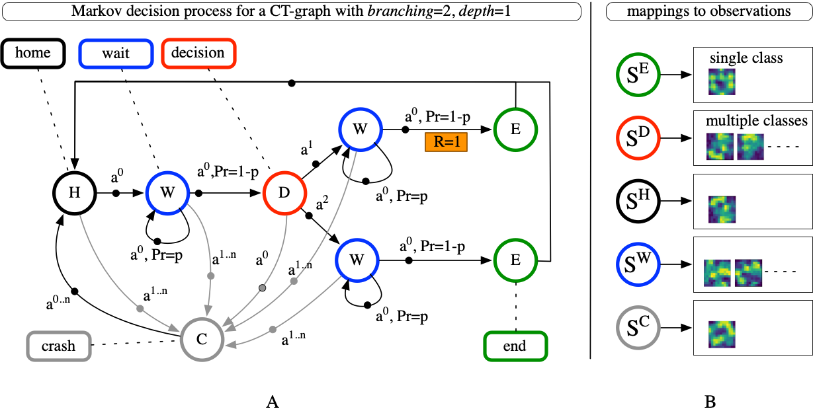
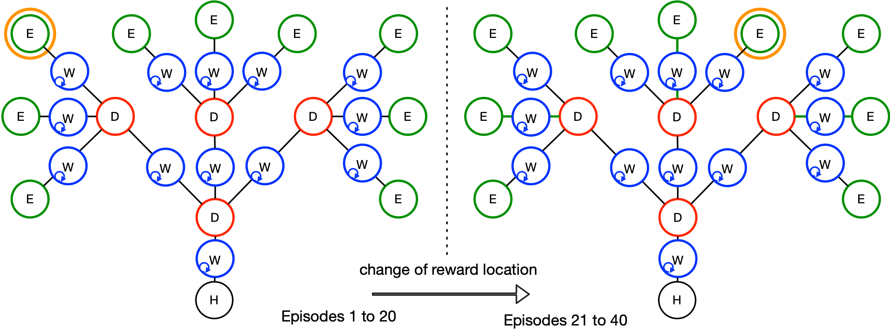

<H1>CT-graph environments - Lifelong Learning Machines (L2M)</H1>

The configurable tree graph (CT-graph): A set of dynamic non-Markov reward-based environments

Copyright (C) 2019-2021 Andrea Soltoggio, Pawel Ladosz, Eseoghene Ben-Iwhiwhu, Jeff Dick.
          
<b>Installation</b>

pip install -e .

<b>Instructions</b>

Files:

- gym_CTgraph: folder with the CT-graph code.

- test_graph.py: script to the perform basic tests of the CT-graph environments.

- testDimRed.py: script to perform checks on the input image dataset, e.g. dimensionality reduction and visualization with t-SNE.

- ilearn.py: simple script to perform classification on the input image dataset.

Using tensorboad:
tensorboard --logdir='./logs' --port=6707

<b> Example of CT-graph with depth=1</b> 

<b> Example of two CT-graphs with depth=2</b> 

<b>Acknowledgement</b>

This material is based upon work supported by the United States Air Force Research Laboratory (AFRL) and Defense Advanced Research Projects Agency (DARPA) under Contract No. FA8750-18-C-0103.

Any opinions, findings and conclusions or recommendations expressed in this material are those of the author(s) and do not necessarily reflect the views of the United States Air Force Research Laboratory (AFRL) and Defense Advanced Research Projects Agency (DARPA).

<b>License</b>

This program is free software: you can redistribute it and/or modify it under the terms of the GNU General Public License as published by the Free Software Foundation, either version 3 of the License, or (at your option) any later version.

This program is distributed in the hope that it will be useful, but WITHOUT ANY WARRANTY; without even the implied warranty of MERCHANTABILITY or FITNESS FOR A PARTICULAR PURPOSE.  See the GNU General Public License for more details.

You should have received a copy of the GNU General Public License along with this program.  If not, see <https://www.gnu.org/licenses/>.
